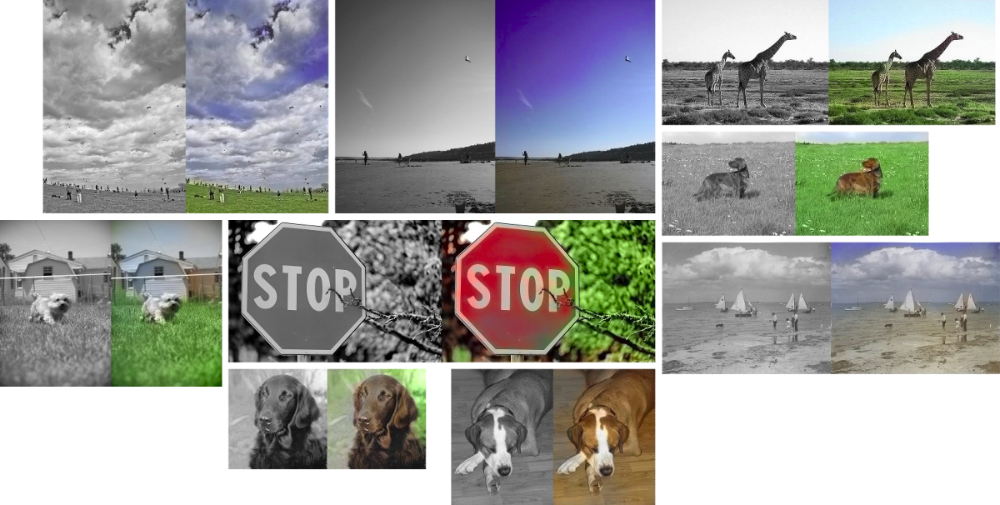

# Automatic Image Colorization
This project aims to reproduce the results from [Colorful Image Colorization](https://richzhang.github.io/colorization/) with some modifications. The files `resources/bins.npy` and `LICENSE` are copied from their repo. The colorization module resides under `colorize/`, and the notebooks demonstrate its usage.

Some example results where our models perform well:

